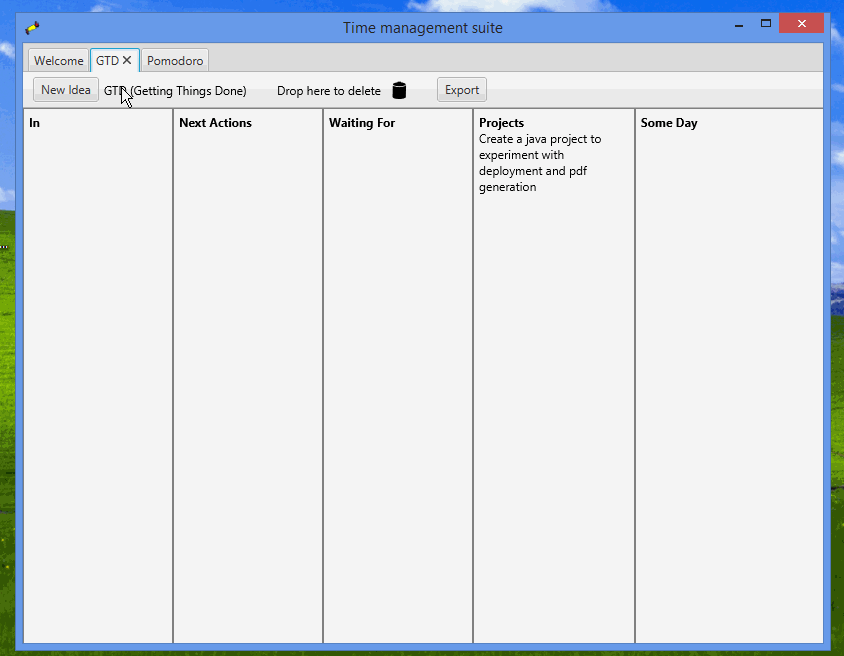

# time-management-suite
A Java desktop app that offers different time management techniques.

Pomodoro technique: https://cirillocompany.de/pages/pomodoro-technique

GTD (Getting Things Done): http://gettingthingsdone.com/

And more...

### Running the program
* Run from IDE
* Run from command line
  * Export a runnable jar from IDE, then run using `java -jar filename.jar` or
   `javaw -jar filename.jar`
* Use startup script (windows)
  * Export runnable jar from IDE, put the jar and start.bat (located in /scripts)
   in the same directory, open the .bat file.

